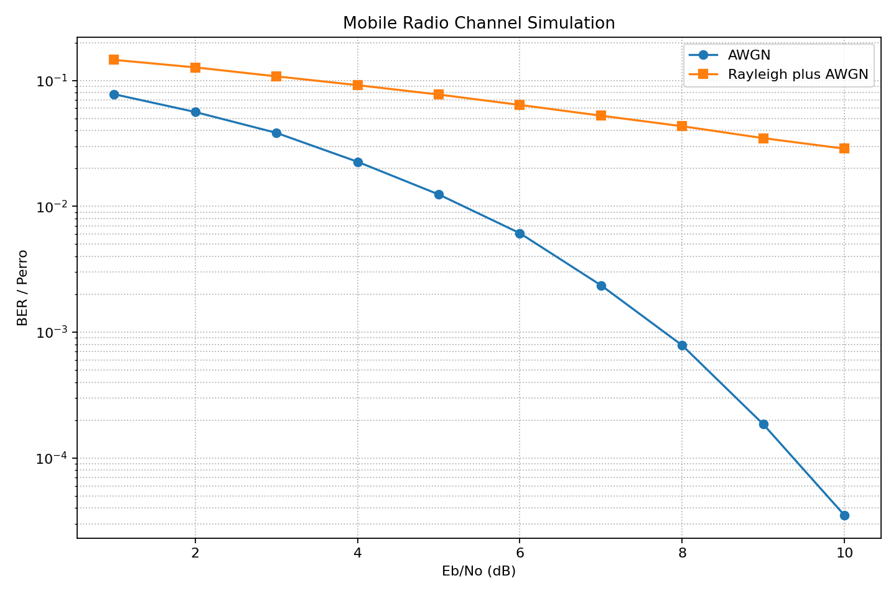

# 📡 Modelagem do Canal Rádio Móvel

Simulação computacional de um canal rádio móvel com modulação **BPSK**, ruído **AWGN** e desvanecimento **Rayleigh**, desenvolvida em Python.

---

## 📋 Descrição

Este projeto implementa a modelagem estatística e computacional de um canal de comunicação rádio móvel, considerando os principais fenômenos que degradam o sinal em ambientes reais:

- **Modulação BPSK** (*Binary Phase Shift Keying*): codificação dos bits de entrada em símbolos de fase binária.
- **Ruído AWGN** (*Additive White Gaussian Noise*): adição de ruído gaussiano branco ao sinal transmitido.
- **Desvanecimento Rayleigh** (*Rayleigh Fading*): modelagem do desvanecimento multipercurso característico de ambientes urbanos sem linha de visada direta (NLOS).


## Rodando o projeto

Basta rodar o arquivo `my_project.py`

Os resultados da simulação são gerados graficamente e salvos em `output.png`.

---

## 🖼️ Resultado da Simulação



---

## 🛠️ Tecnologias Utilizadas

- [Python 3.x](https://www.python.org/)
- [NumPy](https://numpy.org/) — operações numéricas e geração de sinais
- [Matplotlib](https://matplotlib.org/) — visualização e exportação dos gráficos
- [SciPy](https://scipy.org/) *(opcional)* — funções matemáticas complementares

---

## 📁 Estrutura do Projeto

```
.
├── my_project_v001.py # Script principal da simulação
├── main.py            # Script que orquestra a simulação
├── interface.py       # Script com toda sorte de funções matemáticas para simulação
├── binary_number.py   # Script que contém função para geração de código binário aleatório
├── output.png         # Gráfico gerado pela simulação
├── requirements.txt   # Dependências do projeto
└── README.md          # Documentação
```

---

## ▶️ Como Executar

### 1. Clone o repositório

```bash
git clone https://github.com/seu-usuario/nome-do-repositorio.git
cd nome-do-repositorio
```

### 2. Crie e ative um ambiente virtual *(recomendado)*

```bash
python -m venv venv
source venv/bin/activate        # Linux/macOS
venv\Scripts\activate           # Windows
```

### 3. Instale as dependências

```bash
pip install -r requirements.txt
```

### 4. Execute a simulação

```bash
python my_project_v001.py
```

O gráfico será gerado e salvo automaticamente como `output.png` na raiz do projeto.

---

## ⚙️ Parâmetros da Simulação

| Parâmetro         | Descrição                                      | Valor padrão |
|-------------------|------------------------------------------------|--------------|
| `num_bits`        | Número de bits transmitidos                    | `100000`     |
| `snr_db_range`    | Faixa de SNR simulada (dB)                     | `0` a `9`    |
| `modulacao`       | Tipo de modulação                              | `BPSK`       |
| `canal`           | Modelo de canal                                | `Rayleigh`   |

> Os parâmetros podem ser ajustados diretamente no arquivo `main.py`.

---

## 📊 Saídas Geradas

- **Curva BER × SNR**: taxa de erro de bit (*Bit Error Rate*) em função da relação sinal-ruído, comparando:
  - Canal AWGN puro
  - Canal com desvanecimento Rayleigh + AWGN
  - Curva teórica de referência (BPSK-AWGN)

---

## 📚 Referências

- HAYKIN, S. *Sistemas de Comunicação*. 4. ed. Porto Alegre: Bookman, 2004.
- PROAKIS, J. G.; SALEHI, M. *Digital Communications*. 5. ed. McGraw-Hill, 2008.
- RAPPAPORT, T. S. *Wireless Communications: Principles and Practice*. 2. ed. Prentice Hall, 2002.
- SKLAR, B. *Rayleigh Fading Channels in Mobile Digital Communication Systems*. IEEE Communications Magazine, 1997.

---

## 📄 Licença

Este projeto está sob a licença [MIT](LICENSE).

---

## 👤 Autor

**Paulo Alex Carvalho Barata**  
Engenharia de Computação — UEMA  
[github.com/PauloBarataCreator](https://github.com/PauloBarataCreator)
